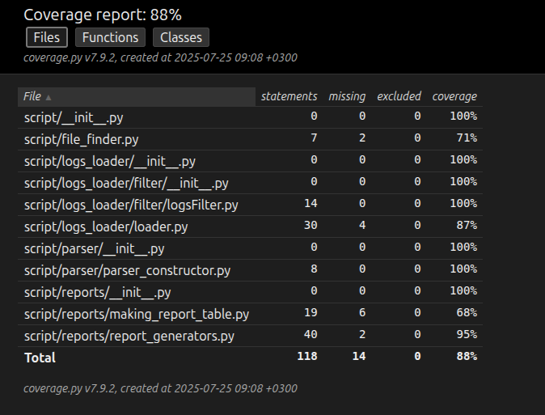
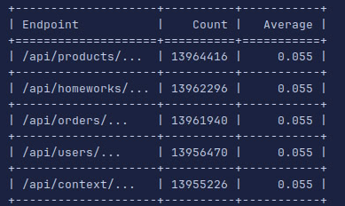
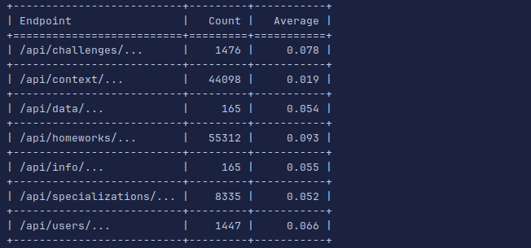
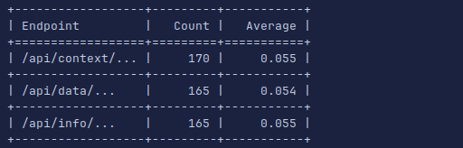

# Cкрипт для обработки лог-файла.

## [Документация](DOCS.md)

## Начало пользования:
1. Склонируйте репозиторий.
2. Создайте и активируйте виртуальное окружение \
`python -m venv .venv`
`source .venv/bin/activate`- Linux, \
`.venv\Scripts\activate `- Windows
3. Установите зависимости `pip install req.txt`.

## Для проверки покрытия кода тестами:
1. `pytest --cov=script --cov-report=html`
2. _macOS_ - `open htmlcov/index.html`,\
   _Linux_ - `xdg-open htmlcov/index.html`,\
   _Windows_ - `start htmlcov/index.html`

## Описание флагов:
1. `--file` - Можно указать как файл из директории проекта(напр. `--file example1.log`) \
или указать абсолютный путь (напр. `--file /path/to/file/in/computer`). \
Для обработки двух и более файлов, определение происходит в формате `--file example1.log --file example2.log`. \
Определять можно несколько файлов как и с использованием абсолютного пути, так и просто через указание имени файла.
2. `--date `- Необязательный флаг указывается в формате YYYY-MM-DD.
3. `--report` - Флаг определяющий тип отчета(напр. `--report average`). \
Доступно ДВА вида отчетов: \
`--report average ` (Подсчитывает количество обращений к URL-адресу)\
`--report User-Agents` (Подсчитывающий какие браузеры используются)

P.S. Для добавления новой логики отчета, не надо переписывать пол скрипта, достаточно добавить функцию \
отчета в модуль **report_generators.py**, и добавить этот отчет в словарь reports из модуля **main.py**.

## Примеры использования кода:

`python main.py --file example1.log --file example2.log --file example3.log --report average`

`python main.py --file example1.log --file example3.log --report User-Agents`

`python main.py --file example1.log --file example2.log --file example3.log --date 2025-07-23 --report average`

